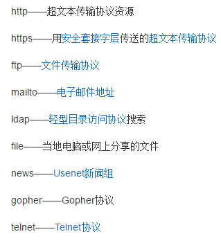
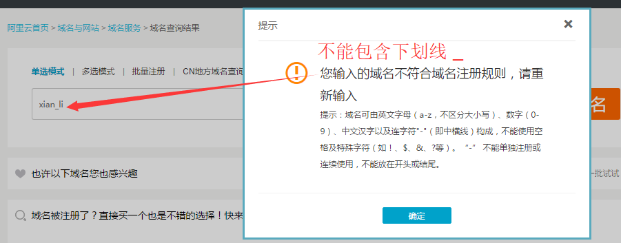
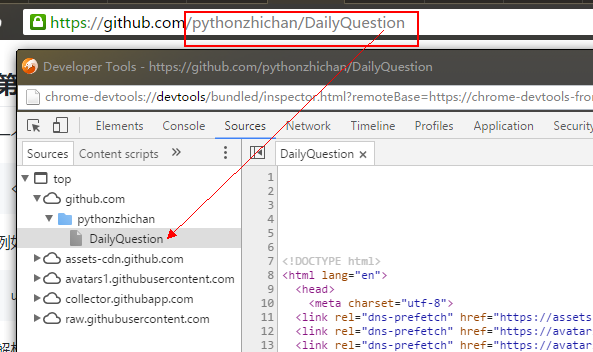

# 分解URL
#### 编写一个程序，把 URL 分解为 5 部分，分别为：schema、net\_loc、path、query\_params、fragment。注意：query\_params 要转换成字典类型
这 5 部分在URL中的位置如下：

```
<scheme>://<netloc>/<path>?<query_params>#<fragment>
```

看到这道题我首先想到的应用场景是数据清洗，分析网页HTML文件里的所有URL链接，然后用正则表达式来做匹配链接中的每一部分
其实这五部分中的单独每一部分都不是必须的，如：
**没有 scheme**
> //s01.mifile.cn/css/index.min.css?a4fc84

**没有 net\_loc（相对路径的形式）**
> ./?t=2017112


其实际的绝对路径是
> https://mp.weixin.qq.com/debug/wxadoc/dev/?t=2017112

**没有 path**
> https://mp.weixin.qq.com

**没有 query\_params**
> https://mp.weixin.qq.com/debug/wxadoc/introduction/#完善小程序信息

**没有 fragment**
> https://mp.weixin.qq.com/debug/wxadoc/design/index.html?t=2017119


## 正则表达式
符号|作用
:------:|:-------:
(?<=M)|匹配以M开头，但不包含M的字符串，如：(?<=//).+，表示匹配以"//"开头的多个字符，如： "https://www.qq.com" 中的 "www.qq.com"
(?=M)|匹配以M结尾，但不包含M的字符串，如：[a-zA-Z]+(?=://)，表示匹配以"://"结尾的多个字母，如：匹配 "https://www.qq.com" 中的 "https"


### schema

第一部分是**模式/协议**，它告诉浏览器如何处理将要打开的文件。常见的协议有 http（超文本传输协议）、https（加密版的http）、ftp（文件传输协议）、……，
其它协议还有：




它在 URL 字符串中的特征是：如果一个URL链接中包含传输协议字符串，那么它肯定是在最前面几个字符串并且它之后是“://”，因为协议都是由字母组成，所以它的正则可以写成一下方式：

```
[a-zA-Z]+(?=://)
```
其中 `(?=://)` 表示以“**://**”结尾，但**不**包含“**://**”
考虑到很多页面的链接也有以不区分协议的方式书写，如下所示：


> //s01.mifile.cn/css/index.min.css?a4fc84

可能还有以下情况：
> s01.mifile.cn/css/index.min.css?a4fc84

所以协议是可有可无，应该在后面加个问号“?”（表示匹配 0次 或 1次）

总结：
协议是由多个字母（不区分大小写）组成并且以“://”结尾（但不包含“://”），不过协议可有可无
翻译成正则表达式就是：
```
([a-zA-Z]+(?=://))?
```


### net\_loc

第二部分是**域名**，它是由英文字母（不区分大小写）、数字、中文汉字（这里不考虑汉字的情况）以及横杠 "-" 构成，不能使用空格及特殊字符（如！、$、&、?等）。“-” 不能单独注册或连续使用，不能放在开头或结尾。因为 **\w** 相当于[a-zA-Z0-9_]，而域名中不能出现下划线_，所以这里**不使用 \w**

```
[a-zA-Z0-9]+-?[a-zA-Z0-9]+\.?
```

域名还可以是多级，如下是微信公众平台官网
> https://mp.weixin.qq.com

所以后面添加个加号“+”，表示至少匹配 1 次
```
([a-zA-Z0-9]+-?[a-zA-Z0-9]+\.?)+
```

域名后缀（如：com、org、cn、……）只由多个字母组成，紧随其后的是斜杠“/”（没有路径时可有可无，不考虑端口号的情况）
继续在后面添加
`\.[a-zA-Z]+(?=\/?)`

变成：
```
([a-zA-Z0-9]+-?[a-zA-Z0-9]+\.?)+\.[a-zA-Z]+(?=\/?)
```

如前面说过有不区分协议的写法，URL 字符串前面可以没有 协议 字符串，这时 URL 不是以“://”开头，而是以“//”开头，还有可能连“//”都没有，所以应该在前面添加
`(?<=//)?`

变成：
```
(?<=\/\/)?([a-zA-Z0-9]+-?[a-zA-Z0-9]+\.)+\.[a-zA-Z]+(?=\/?)
```

前面说过页面链接中可能存在相对路径，也就是说域名也是可有可无的，所以同样需要在后面添加一个问号“?”，表示匹配 0 次或 1 次

总结：
域名是以“//”开头（但不包含“//”，也可能没有），可以由字母（不区分大小写）、数字、横杠组成，多级域名间用点“.”分隔，顶级域名只由多个字母组成，后面紧挨着一个斜杠“/”（可有可无）。
翻译成正则表达式就是：
```
((?<=//)?([a-zA-Z0-9]+-?[a-zA-Z0-9]+\.?)+\.[a-zA-Z]+(?=\/)?)?
```
因为外面又套了一层 ()? ，测试时发现域名匹配不了了，不知道是什么原因，所以先不考虑相对路径的情况，先不加 ()? 
```
(?<=//)?([a-zA-Z0-9]+-?[a-zA-Z0-9]+\.?)+\.[a-zA-Z]+(?=\/)?
```

### path

第三部分是**路径**。如果包含问号“?”，则紧挨 域名 字符串之后的斜杠“/”到问号“?”之间的为路径字符串。匹配“/”时，为了避免匹配到协议后面的“://”，可以让“/”前面多识别一个字母（不是字符，因为域名后缀（如：com、org、cn、……）都是由字母组成的）。
不考虑中文或其它语言的情况


因为路径是以斜杠“/”开头，最短的路径也是它（可有可无），所以写成路径开头的正则写成这样：
```
(?<=[a-zA-Z])\/?
```

路径本质上是指向某个目录下的文件，而有时看到的 URL 好像只有路径，其实最后一个“目录”就是没有后缀、内容为 html 文本的文件，如下：



> https://github.com/pythonzhichan/DailyQuestion

而路径又分为绝对路径与相对路径，如下：


其实际的绝对路径是

> https://mp.weixin.qq.com/debug/wxadoc/dev/?t=2017112

这种情况比较复杂就先不考虑

路径中的字符可选范围比较广，不像域名有那么多限制
```
((?<=[a-zA-Z])?(\.?\/[\w\-\.\#\%\(\)\']+)+)?
```
同样，和域名类似，因为外面又套了一层 ()? ，测试时发现路径匹配不了，不知道是什么原因，还是先不加 ()? 
```
(?<=[a-zA-Z])?(\.?\/[\w\-\.\#\%\(\)\']+)+
```

### query\_params

第四部分是**查询参数**，路径之后以问号“?”开始（不包含“?”），等号左右两边分别是参数关键字及其对应的值，参数之间以“&”符号分隔，如：
> http://mp.weixin.qq.com/s?__biz=MzA4MjEyNTA5Mw==&mid=2652566513#wechat_redirect

key:
```
(?<=\?|\&)[\w\-]+(?=\=)
```

value:
```
(?<=\=)[\w\-\=]+(?=\&)?
```

### fragment

第五部分是**分段**，通常是查询参数部分之后的井号“#”后面的字符串，如：
> http://mp.weixin.qq.com/s?__biz=MzA4MjEyNTA5Mw==&mid=2652566513#wechat_redirect

第五部分也是可有可无
可以看出 **wechat\_redirect** 是最后一个字符串，它作为结尾
所以它的正则表达式可以写成：
```
((?<=\#)([\w\-\/\.]*))?$
```

## 正则表达式方法
方法|功能
:----------:|:---------:
match()|仅匹配字符串的开头部分，其它位置无法匹配，返回 match 对象或 None
search()|搜索字符串的所有位置，以找到匹配的字符串，返回 match 对象或 None
findall()|所有匹配项组成一个列表返回

因为查询参数要以字典类型输出，所以将 findall() 返回的 key 列表、value 列表 组成字典，然后将该字典作为参数传入字典的 update() 方法中实现添加

## 完整代码
为了保证调试正则时知道是哪部分写的有问题，方便调错修改，所以没选择把五部分的正则写在一起
```python
import re
class url:
	def __init__(self, url_str):
		self.url_str=url_str

	def url_parse(self):
		# 协议
		m = re.search(r"([a-zA-Z]+(?=://))?", self.url_str)
		scheme=m.group()

		# 主机名
		m = re.search(r"(?<=//)?([a-zA-Z0-9]+-?[a-zA-Z0-9]+\.?)+\.[a-zA-Z]+(?=\/)?", self.url_str)
		netloc=m.group()

		# 路径
		m = re.search(r"(?<=[a-zA-Z])?(\/[\w\-\.\#\%\(\)\']+)+", self.url_str)
		path=m.group()

		# 查询参数
		query_params_key = re.findall(r"(?<=\?|\&)[\w\-]+(?=\=)", self.url_str)
		query_params_value = re.findall(r"(?<=\=)[\w\-\=\%]+(?=\&)?", self.url_str)
		query_params = {}
		for index in range(len(query_params_key)):
			query_params.update({query_params_key[index] : query_params_value[index]})

		# 分段（指定id所在的位置）
		m = re.search(r"((?<=\#)([\w\-\/\.]*))?$", self.url_str)
		fragment=m.group()

		print("scheme:", scheme)
		print("netloc:", netloc)
		print("path:", path)
		print("query_params:", query_params)
		print("fragment:", fragment, "\n")


if __name__ == "__main__":
	try:
		while True:
			url_str = input("解析URL：")
			urlapp = url(url_str)
			urlapp.url_parse()
	except KeyboardInterrupt:
		print("结束\n")
```